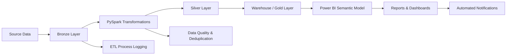

# PSCMD — Data Engineering & Analytics Platform

**End-to-End Procurement Data Engineering, Analytics & Reporting Project**


---

## 📌 Project Overview

**PSCMD** is an end-to-end procurement data engineering and analytics platform designed to transform raw procurement data into structured, reliable, and business-ready datasets for reporting and decision-making.

The project demonstrates how modern data engineering practices can be used to build a complete data platform covering:

* Data ingestion
* Data transformation
* Data cleansing
* Data quality
* Incremental processing
* Deduplication
* Data warehousing
* Business logic
* Analytics
* Row-Level Security
* Process monitoring
* Automated reporting and notifications

The platform is built using **Microsoft Fabric, OneLake, Lakehouse, PySpark, SQL, Power BI, DAX, and Python**.

> 🔒 **Portfolio Note:** This repository contains a sanitized portfolio implementation. Confidential organizational data, credentials, internal infrastructure details, and proprietary datasets are intentionally excluded.

---

# 🏗️ Architecture

The project follows a layered data architecture:



### Architecture Layers

| Layer                | Purpose                                     |
| -------------------- | ------------------------------------------- |
| **Source**           | Raw procurement source data                 |
| **Bronze**           | Initial landing and staging of source data  |
| **Silver**           | Cleansed, transformed and standardized data |
| **Warehouse / Gold** | Business-ready analytical data              |
| **Semantic Model**   | Power BI analytical layer                   |
| **Reporting**        | KPIs, dashboards and business insights      |

---

# 🔄 Data Engineering Pipeline

The overall pipeline follows:

**Source → Bronze → Silver → Warehouse/Gold → Power BI**

### 1. Source Data

Raw procurement data is received from source systems in structured file-based formats.

The source data contains information required for procurement analysis, including transactional and master-data information.

---

### 2. Bronze Layer

The Bronze layer acts as the initial landing and staging layer.

Key responsibilities include:

* Ingesting source files
* Maintaining raw data structure
* Initial validation
* File-level processing
* Supporting downstream transformation

The Bronze layer is designed as a controlled staging area rather than the final analytical dataset.

---

### 3. Silver Layer

The Silver layer contains transformed and cleansed data.

Processing includes:

* Data cleansing
* Data type standardization
* Business-rule implementation
* Duplicate handling
* Incremental processing
* Data validation
* Key generation
* Transformation of source-system structures into analytical structures

PySpark is used extensively for transformation and processing.

---

### 4. Warehouse / Gold Layer

The Warehouse/Gold layer provides business-ready datasets for analytics.

This layer contains:

* Fact tables
* Dimension tables
* Business calculations
* Procurement-related analytical structures
* Reporting-ready datasets

SQL is used to implement additional business logic and warehouse processing.

---

# 🧹 Data Quality & Deduplication

Data quality is an important component of the platform.

The project implements techniques such as:

* Duplicate detection
* Record deduplication
* Business-key generation
* Data validation
* Incremental processing
* Data consistency checks

A hash-based business key strategy is used where appropriate to identify records based on relevant business attributes.

Records can then be evaluated using processing timestamps so that the appropriate version of a record is retained.

---

# ⚡ Incremental Data Processing

The platform is designed to avoid unnecessarily processing the complete historical dataset during every execution.

Incremental processing is used to:

* Process newly received data
* Update existing records where required
* Reduce unnecessary processing
* Improve pipeline efficiency
* Maintain historical analytical data

This approach makes the solution more scalable as data volume increases.

---

# 📊 Analytics & Power BI

The processed warehouse data is consumed by **Power BI** for business reporting and analytics.

The analytical layer includes procurement-focused KPIs such as:

* Purchase quantity
* Purchase value
* Consumption
* Discounts
* Average unit cost
* Procurement trends
* Category analysis
* Supplier-related analysis
* Inventory movement
* Year-to-date analysis

DAX is used to implement analytical calculations and dynamic reporting logic.

---

# 🔐 Security & Row-Level Access

The project also demonstrates implementation of **Row-Level Security (RLS)**.

A mapping-based security approach is used to control which business data a user can access.

The design includes:

* User-to-business-unit mapping
* Security predicates
* Role-based access
* Restricted data visibility
* Power BI security integration

This allows the same analytical model to support users with different data-access requirements.

---

# 📋 ETL Monitoring & Process Logging

Pipeline execution is monitored through an ETL process logging mechanism.

The logging approach is designed to capture information such as:

* Pipeline execution
* Processing status
* Processing stages
* Success/failure information
* Execution timing
* Data-processing events

This provides better visibility into pipeline health and simplifies troubleshooting.

---

# 📧 Automation & Notifications

The solution also integrates automation into the reporting workflow.

Automated processes can be used for:

* Report generation
* File processing
* Workflow execution
* Status notifications
* Email alerts

This reduces manual intervention and helps ensure that important processing or reporting events are communicated to stakeholders.

---

# 🛠️ Technology Stack

### Data Engineering

* Microsoft Fabric
* OneLake
* Lakehouse
* Data Pipelines
* PySpark
* Python
* SQL
* Delta Lake

### Analytics

* Power BI
* DAX
* Power BI Semantic Models
* Data Warehousing

### Automation

* Power Automate
* Email Notifications
* Automated File Processing

### Development

* Visual Studio Code
* Git
* GitHub

---

# 📁 Repository Structure

```text
PSCMD-Data-Engineering-Analytics/
│
├── architecture/
│   └── README.md
│
├── notebooks/
│   └── README.md
│
├── sql/
│   └── README.md
│
├── pipelines/
│   └── README.md
│
├── powerbi/
│   └── README.md
│
├── docs/
│   └── README.md
│
├── data/
│   └── README.md
│
└── README.md
```

Each directory will document a specific component of the platform.

---

# 🎯 Key Engineering Concepts Demonstrated

This project demonstrates practical experience with:

* Modern data platform architecture
* Medallion architecture
* ETL / ELT
* Microsoft Fabric
* Lakehouse architecture
* Data warehousing
* PySpark transformations
* SQL development
* Incremental data processing
* Data deduplication
* Business-key design
* Data quality
* Process monitoring
* Power BI semantic modeling
* DAX
* Row-Level Security
* Workflow automation
* Business analytics

---

# 📈 Project Goals

The main goals of PSCMD are to:

1. Build a reliable procurement data platform.
2. Automate data ingestion and transformation.
3. Improve data quality and consistency.
4. Create reusable analytical datasets.
5. Provide business-ready procurement KPIs.
6. Implement secure data access.
7. Improve pipeline monitoring and operational visibility.
8. Reduce manual reporting activities.
9. Demonstrate modern data engineering practices.

---

# 🚀 Future Improvements

Potential future enhancements include:

* Metadata-driven ingestion
* Automated data-quality testing
* More comprehensive pipeline monitoring
* CI/CD integration
* Automated deployment between environments
* Additional analytical models
* Advanced procurement forecasting
* Machine-learning integration
* Automated documentation
* Enhanced observability and alerting

---

# 🔒 Data & Security Disclaimer

This repository is intended for **portfolio and demonstration purposes**.

No confidential organizational data, credentials, production connection information, internal server information, proprietary source files, or sensitive business information should be committed to this repository.

Where necessary, project examples will use:

* Synthetic data
* Sample datasets
* Sanitized SQL
* Generic configuration
* Architectural diagrams
* Representative code

---

# 👨‍💻 Author

**Aamir Ali**

**Data Analyst | Data Engineer | Aspiring Data Scientist**

GitHub: [Aamirk4560](https://github.com/Aamirk4560)

---

⭐ If you find this project useful, feel free to explore the repository and its individual components.
