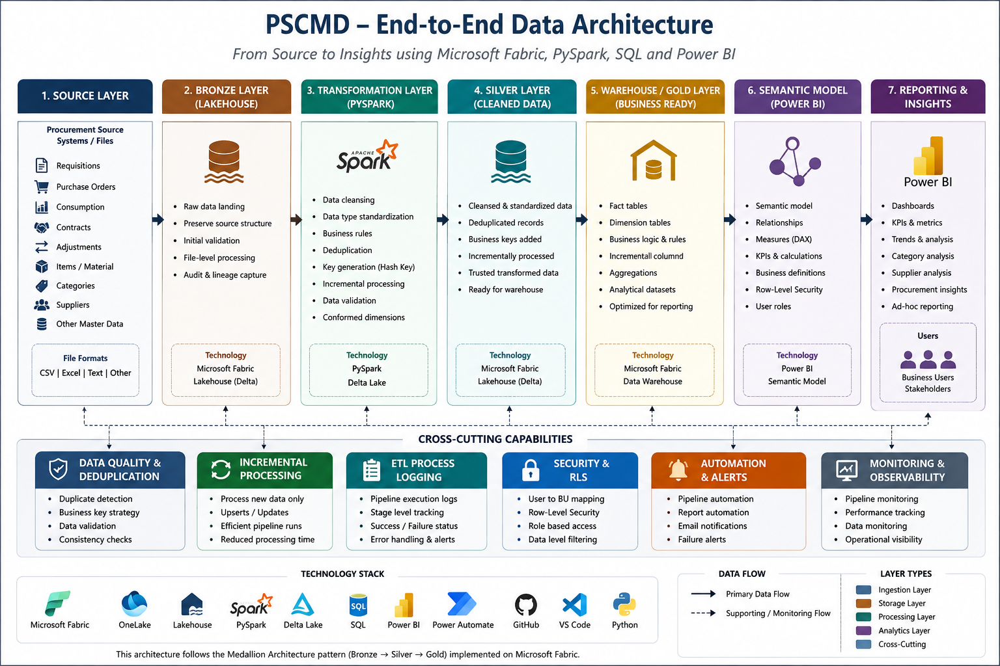
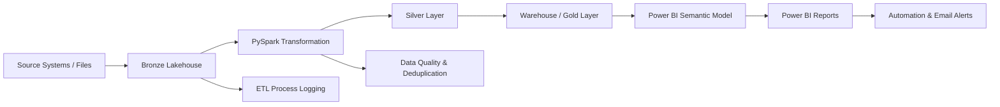

#Procurement Architecture



## Overview

The Procurement platform follows a layered data architecture designed to move procurement data from raw source files to structured, business-ready analytical datasets.

The architecture separates ingestion, transformation, storage, business logic, analytics, security, and reporting responsibilities.

---

## End-to-End Architecture



---

# 1. Source Layer

The source layer contains raw procurement data received from upstream source systems.

The portfolio implementation represents these sources using sanitized or sample data.

Typical source information can include:

* Procurement transactions
* Requisitions
* Purchase orders
* Consumption
* Contracts
* Adjustments
* Item and category information
* Other procurement master and transactional data

The source layer is treated as the system of record for incoming data.

---

# 2. Bronze Layer

The Bronze layer is the initial landing and staging layer within the data platform.

### Responsibilities

* Receive source data
* Preserve incoming records
* Maintain source-level information
* Support controlled ingestion
* Provide input for downstream transformations

The Bronze layer is intentionally kept close to the original source structure.

This allows the ingestion process to remain separated from business transformations.

---

# 3. Transformation Layer

PySpark is used to transform the data between the raw and analytical layers.

### Main processing activities

* Data cleansing
* Data type conversion
* Standardization
* Business-rule implementation
* Duplicate detection
* Record deduplication
* Key generation
* Incremental processing
* Data validation

The transformation layer is designed to make the incoming data consistent before it reaches the analytical layer.

---

# 4. Silver Layer

The Silver layer contains cleansed and transformed data.

Compared with Bronze, the Silver layer is more structured and suitable for downstream analytical processing.

### Key characteristics

* Cleaned data
* Standardized structures
* Business transformations
* Deduplicated records
* Incrementally processed data
* Consistent analytical keys

The Silver layer acts as the main trusted transformation layer before warehouse processing.

---

# 5. Warehouse / Gold Layer

The Warehouse/Gold layer contains business-ready data structures.

This layer is optimized for analytical consumption rather than raw ingestion.

It can contain:

* Fact tables
* Dimension tables
* Business rules
* Calculated attributes
* Reporting datasets
* Analytical structures

SQL is used to implement warehouse-level processing and business logic where appropriate.

---

# 6. Power BI Semantic Model

The warehouse data is exposed to Power BI through a semantic model.

The semantic layer provides:

* Business-friendly data structures
* Relationships
* Measures
* Calculated metrics
* Filtering
* Security
* Analytical definitions

DAX is used to create business KPIs and analytical calculations.

---

# 7. Power BI Reporting

The reporting layer presents procurement information to business users.

Examples of analytical areas include:

* Procurement value
* Procurement quantity
* Consumption
* Discounts
* Average unit cost
* Trends
* Category analysis
* Supplier analysis
* Inventory movement
* Year-to-date analysis

The goal is to convert processed data into actionable business information.

---

# 8. Data Quality & Deduplication

Data quality checks are integrated into the processing workflow.

The platform applies techniques including:

* Duplicate detection
* Business-key generation
* Record validation
* Data consistency checks
* Incremental record processing

A hash-based key can be generated from relevant business attributes to help identify logically equivalent records.

Where multiple versions of a record exist, processing timestamps can be used to determine the appropriate record version.

---

# 9. Incremental Processing

The platform is designed to support incremental data processing instead of repeatedly rebuilding the entire historical dataset.

The processing pattern can be summarized as:

```text
New Source Data
      ↓
Bronze
      ↓
Identify New / Changed Records
      ↓
Transform
      ↓
Deduplicate
      ↓
Silver
      ↓
Warehouse / Gold
```

This approach helps reduce unnecessary processing and supports scalability as the dataset grows.

---

# 10. ETL Process Logging

Pipeline execution is tracked through an ETL process logging mechanism.

The logging layer provides operational visibility into processing activities.

Examples of information that can be recorded include:

* Execution status
* Processing stage
* Execution timestamp
* Success or failure
* Processing events
* Error information

This makes troubleshooting and operational monitoring easier.

---

# 11. Security

The platform supports controlled access to analytical data.

Row-Level Security can be implemented using a mapping-based approach.

The security model can associate users with authorized organizational or business-unit values.

Conceptually:

```text
User
  ↓
Security Mapping
  ↓
Authorized Business Unit
  ↓
Filtered Data
  ↓
Power BI Report
```

This allows different users to consume the same analytical model while seeing only the data they are authorized to access.

---

# 12. Automation

Automation is used around the data and reporting workflow.

Potential automated activities include:

* File processing
* Pipeline execution
* Report workflows
* Status notifications
* Email alerts

Automation reduces manual intervention and improves operational consistency.

---

# Architecture Principles

The PSCMD platform follows several core engineering principles:

### Separation of concerns

Ingestion, transformation, warehouse processing, analytics, and reporting are separated into distinct layers.

### Reusability

Transformation and business logic are designed to be reusable rather than duplicated across multiple processes.

### Data quality

Data is validated, standardized, and deduplicated before being consumed for analytics.

### Incremental processing

Only required data should be processed where possible instead of repeatedly processing the complete historical dataset.

### Security

Access to sensitive analytical information should be controlled through appropriate security mechanisms.

### Observability

Pipeline processing should generate sufficient logging information to identify failures and support troubleshooting.

### Scalability

The architecture is designed so that data volume and reporting requirements can grow without requiring a complete redesign.

---

# Technology Mapping

| Architecture Component | Technology              |
| ---------------------- | ----------------------- |
| Source                 | Source files / systems  |
| Data Platform          | Microsoft Fabric        |
| Storage                | OneLake / Lakehouse     |
| Bronze                 | Fabric Lakehouse        |
| Transformation         | PySpark                 |
| Silver                 | Fabric Lakehouse        |
| Warehouse              | Fabric Data Warehouse   |
| Business Logic         | SQL                     |
| Semantic Layer         | Power BI Semantic Model |
| Analytics              | Power BI / DAX          |
| Automation             | Power Automate          |
| Development            | Python / VS Code        |
| Version Control        | Git / GitHub            |

---

## Portfolio Implementation

This repository will progressively document the different components of the PSCMD platform.

The implementation will be organized as:

```text
architecture/
    Architecture documentation

notebooks/
    PySpark transformation examples

sql/
    SQL scripts and warehouse logic

pipelines/
    Pipeline design and orchestration

powerbi/
    Analytics and semantic-model documentation

docs/
    Detailed project documentation

data/
    Sanitized/sample datasets
```

> **Important:** Production credentials, internal server information, confidential datasets, proprietary source files, and organization-specific sensitive information are intentionally excluded from this repository.
